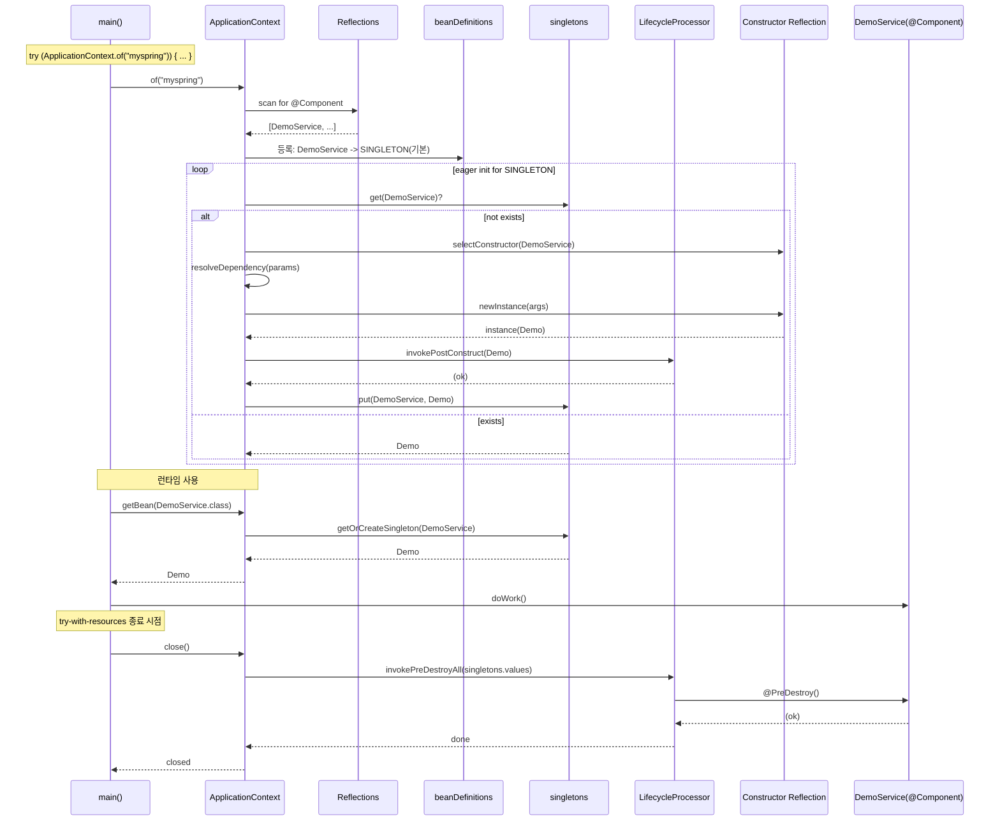

```mermaid
sequenceDiagram
    participant Main as main()
    participant AppCtx as ApplicationContext
    participant Ref as Reflections
    participant Def as beanDefinitions
    participant Single as singletons
    participant LP as LifecycleProcessor
    participant Ctor as Constructor Reflection
    participant Demo as DemoService(@Component)

    Note over Main: try (ApplicationContext.of("myspring")) { ... }
    Main->>AppCtx: of("myspring")
    AppCtx->>Ref: scan for @Component
    Ref-->>AppCtx: [DemoService, ...]
    AppCtx->>Def: 등록: DemoService -> SINGLETON(기본)
    loop eager init for SINGLETON
        AppCtx->>Single: get(DemoService)?
        alt not exists
            AppCtx->>Ctor: selectConstructor(DemoService)
            AppCtx->>AppCtx: resolveDependency(params)
            AppCtx->>Ctor: newInstance(args)
            Ctor-->>AppCtx: instance(Demo)
            AppCtx->>LP: invokePostConstruct(Demo)
            LP-->>AppCtx: (ok)
            AppCtx->>Single: put(DemoService, Demo)
        else exists
            Single-->>AppCtx: Demo
        end
    end

    Note over Main,AppCtx: 런타임 사용
    Main->>AppCtx: getBean(DemoService.class)
    AppCtx->>Single: getOrCreateSingleton(DemoService)
    Single-->>AppCtx: Demo
    AppCtx-->>Main: Demo
    Main->>Demo: doWork()

    Note over Main: try-with-resources 종료 시점
    Main->>AppCtx: close()
    AppCtx->>LP: invokePreDestroyAll(singletons.values)
    LP->>Demo: @PreDestroy()
    Demo-->>LP: (ok)
    LP-->>AppCtx: done
    AppCtx-->>Main: closed

```