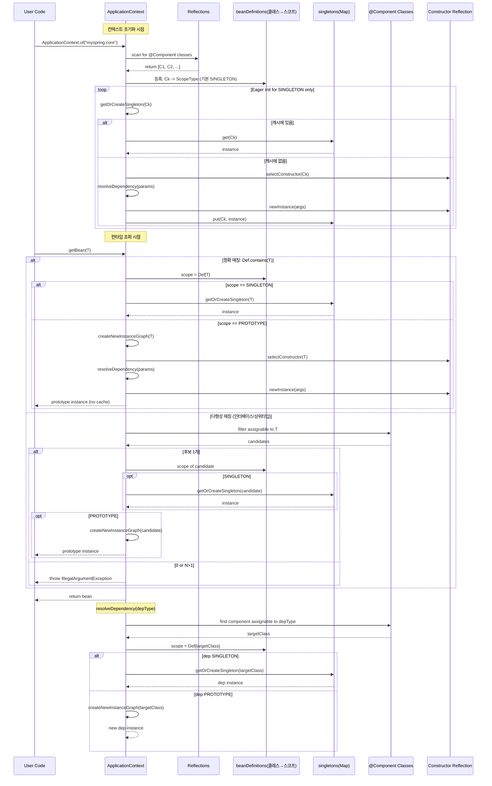
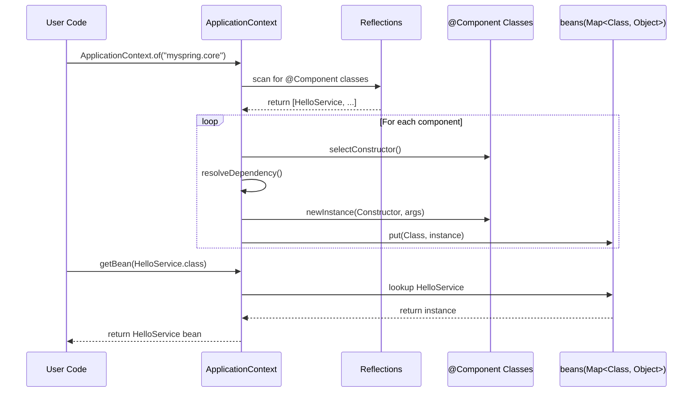

## ApplicationContext Full Sequence Diagram
- 스코프 추가, 지연 초기화, 다형성 조회 등을 포함한 시퀀스 다이어그램 
### 포인트 요약
- 싱글톤: 초기화 때(또는 최초 요청 시) 한 번 생성 → singletons 캐시에 저장 후 재사용.
- 프로토타입: 요청/주입 시마다 새로 생성, 캐시에 저장하지 않음.
- 의존성 주입도 스코프 규칙을 그대로 따름(싱글톤 주입=캐시, 프로토타입 주입=새 생성).

### ApplicationContext Sequence Diagram
