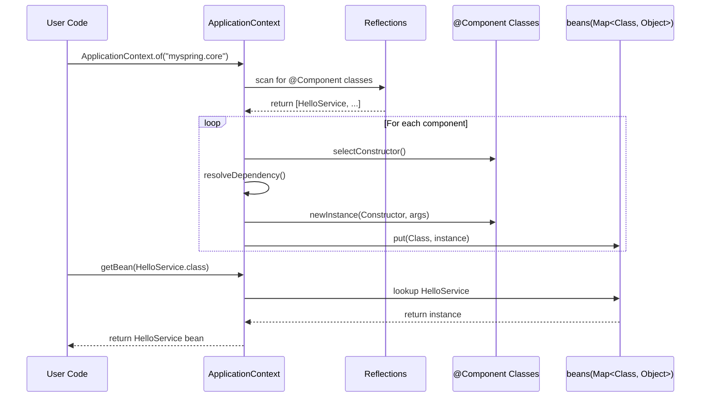

```mermaid
sequenceDiagram
participant User as User Code
participant AppCtx as ApplicationContext
participant Ref as Reflections
participant Class as @Component Classes
participant Beans as beans(Map<Class, Object>)

    User->>AppCtx: ApplicationContext.of("myspring.core")
    AppCtx->>Ref: scan for @Component classes
    Ref-->>AppCtx: return [HelloService, ...]
    loop For each component
        AppCtx->>Class: selectConstructor()
        AppCtx->>AppCtx: resolveDependency()
        AppCtx->>Class: newInstance(Constructor, args)
        AppCtx->>Beans: put(Class, instance)
    end
    User->>AppCtx: getBean(HelloService.class)
    AppCtx->>Beans: lookup HelloService
    Beans-->>AppCtx: return instance
    AppCtx-->>User: return HelloService bean

```